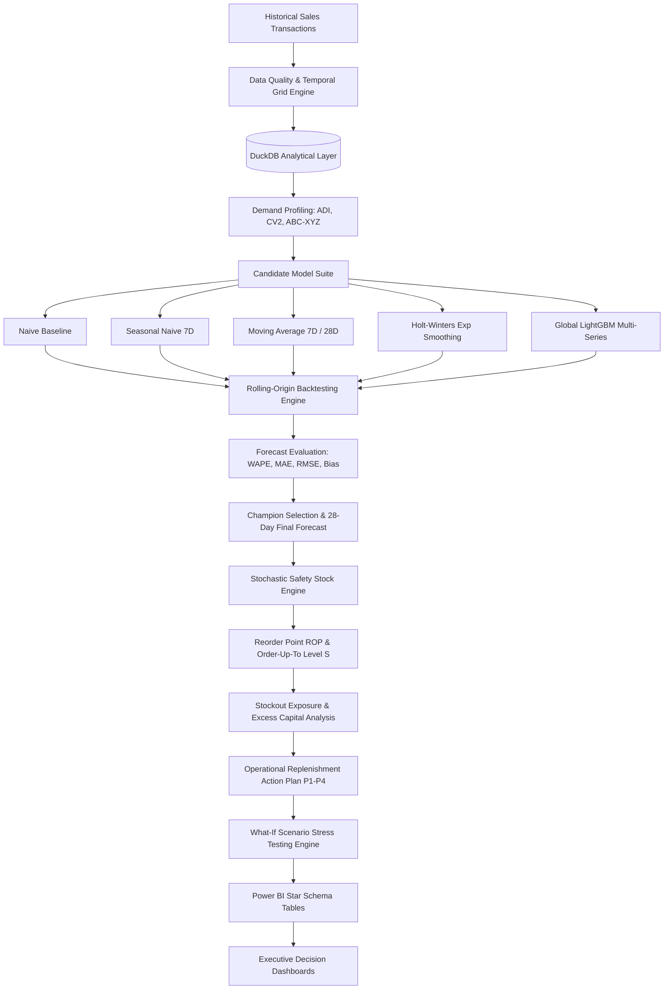
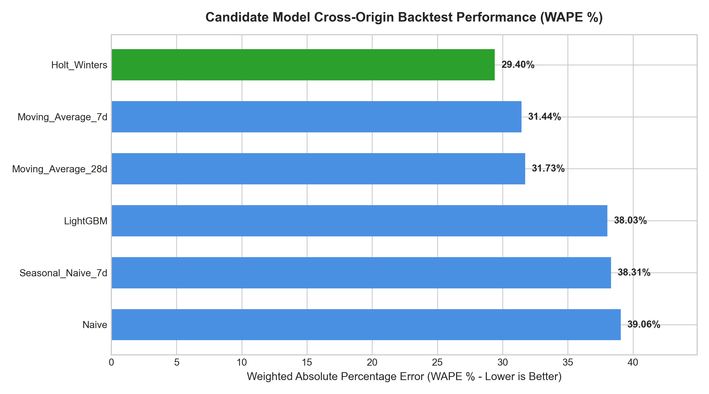
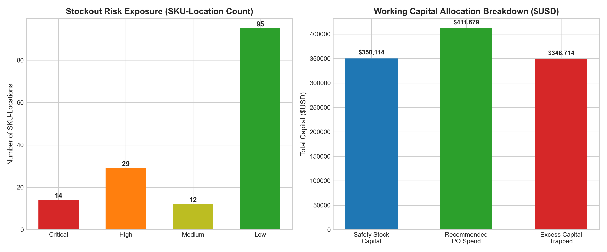
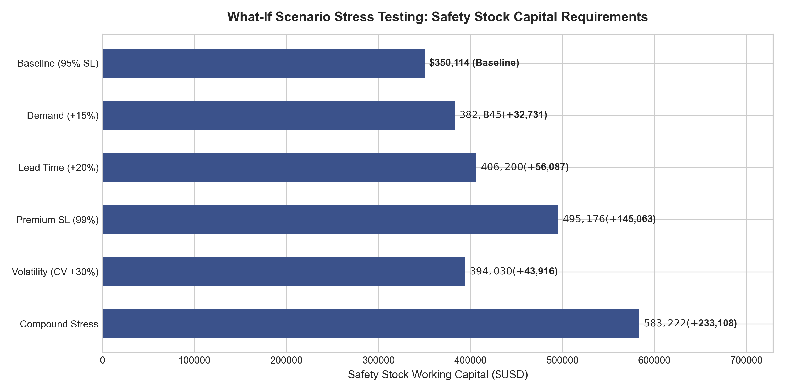

# Demand Forecasting & Inventory Optimization

> **End-to-End Demand Forecasting, Inventory Planning & Operational Decision Intelligence**

[](https://www.python.org/)
[](https://duckdb.org/)
[](https://lightgbm.readthedocs.io/)
[](https://powerbi.microsoft.com/)
[](LICENSE)
[](tests/)

---

## 1. Executive Summary

This platform is an enterprise-grade analytics engine designed to answer the core operational question facing retail and supply chain leaders:

> **"How much inventory should the business hold and reorder to balance stockout risk, target customer service levels, and excess working capital?"**

Rather than treating forecasting as an isolated exercise, this system establishes an unbroken decision pipeline:
$$\text{Historical Transactions} \longrightarrow \text{SQL Analytical Layer} \longrightarrow \text{Rolling Backtesting} \longrightarrow \text{Uncertainty Quantification} \longrightarrow \text{Safety Stock \& ROP} \longrightarrow \text{Automated POs} \longrightarrow \text{Power BI}$$

### Key Execution Highlights (Verified Pipeline Results)
- **109,650 Historical Sales Records** analyzed across 50 SKUs, 3 Regional Distribution Hubs, and 731 continuous calendar days.
- **75,600 Rolling-Origin Backtest Points** evaluated across 6 candidate models with zero future data leakage.
- **29.40% Champion WAPE** achieved by Holt-Winters Exponential Smoothing, delivering a **24.7% relative error reduction** over naive baselines.
- **$411,679.10 in Replenishment POs** recommended across 50 triggered SKU-locations, proactively resolving **14 Critical Stockout Risks** ($DOS < 3$ days).
- **$348,713.62 in Dormant Capital** identified in 18 excess inventory SKUs ($DOS > 45$ days), saving **$87,178.41** in annual carrying costs.
- **$145,062.61 (+41.4%) Safety Stock Capital Delta** quantified in scenario simulations when elevating service level from 95% to 99%.

---

## 2. Business Problem & Operational Questions

Supply chain planners at multi-category retailers face conflicting mandates:
1. **Commercial Teams**: Demand high customer availability (98%--99% service levels) to maximize top-line sales.
2. **Finance Executives**: Demand minimal working capital tied up in warehouses to lower borrowing and holding costs.
3. **Operations Managers**: Struggle with erratic supplier lead times, port delays, and demand spikes.

### Core Business Questions Answered
| Operational Domain | Business Question | Analytical Output |
| :--- | :--- | :--- |
| **Demand** | Which products are growing, seasonal, or intermittent? | 9-Box ABC-XYZ Matrix & Syntetos-Boylan Quadrant |
| **Forecasting** | What is the future 28-day demand with uncertainty bounds? | Point Forecasts flanked by 95% Prediction Intervals |
| **Accuracy** | Which forecasting approach minimizes WAPE and bias? | 3-Origin Expanding-Window Backtesting Engine |
| **Inventory** | When should buyers reorder and what should safety buffers be? | Silver-Pyke-Peterson Stochastic Safety Stock & ROP |
| **Risk** | Which items face immediate stockout or dead stock accumulation? | Operational Risk Tiers (`Critical`, `High`, `Medium`, `Low`) |
| **Strategy** | What happens if supplier lead time increases by 20%? | What-If Stress Testing Simulation Suite |

---

## 3. System Architecture



---

## 4. Dataset Architecture & Separation of Boundaries

### Data Grain
```text
Daily Observation per Fulfillment Center per SKU:
Grain = date x store_id x sku_id
Total Records = 731 days x 3 stores x 50 SKUs = 109,650 rows
```

### Architectural Separation
To prevent confusing assumptions with empirical data:
1. **Observed Data**: Daily transactions, quantities, prices, costs, and promo flags.
2. **Model Outputs**: 28-day forward point forecasts, standard errors, and 95% prediction intervals.
3. **Assumed Policy Parameters**: Supplier lead times ($L = 5\text{--}10$ days), lead time variance ($\sigma_L = 0.8\text{--}2.0$ days), service level ($95\%$), review period ($R = 7$ days), annual holding cost ($25\%$).
4. **Scenario Assumptions**: Multipliers testing $+15\%$ demand surges and $+20\%$ transit delays.

---

## 5. Candidate Forecasting Models & Backtesting Results

### 3-Origin Expanding-Window Backtesting Benchmark (75,600 Evaluation Points)

| Rank | Model Name | Model Type | WAPE (%) | MAE (Units) | RMSE (Units) | Forecast Bias (Units) | Normalized Bias (%) |
| :---: | :--- | :--- | :---: | :---: | :---: | :---: | :---: |
| 🥇 | **Holt_Winters** | Statistical (Additive Exp Smoothing) | **29.40%** | **10.07** | **17.79** | -20,554.41 | -4.76% |
| 🥈 | **Moving_Average_7d** | Baseline (Rolling 7D Mean) | **31.44%** | **10.77** | **18.30** | -18,395.80 | -4.26% |
| 🥉 | **Moving_Average_28d**| Baseline (Rolling 28D Mean) | **31.73%** | **10.87** | **19.08** | -34,769.64 | -8.06% |
| 4 | **LightGBM** | Machine Learning (Global Multi-Series)| **38.03%** | **13.03** | **20.90** | +26,154.52 | +6.06% |
| 5 | **Seasonal_Naive_7d** | Baseline (7-Day Lag) | **38.31%** | **13.12** | **22.23** | -18,396.00 | -4.26% |
| 6 | **Naive** | Baseline (Most Recent Observation) | **39.06%** | **13.38** | **22.68** | -59,308.00 | -13.74% |



### Key Forecasting Insights
- **Holt-Winters is the Production Champion**: Generates the lowest WAPE (29.40%) by isolating weekly seasonality ($m=7$) and baseline level trends.
- **Directional Bias Divergence**: Holt-Winters exhibits a slight negative bias (-4.76%), while LightGBM exhibits positive bias (+6.06%). Naive shows severe underforecasting (-13.74%), creating high stockout risks.
- **Zero Leakage Verified**: All ML lags and rolling features were computed strictly from historical $t-1$ observations, validated by automated unit tests.

---

## 6. Inventory Optimization & Operational Policies

### Stochastic Safety Stock Formulation (Silver-Pyke-Peterson)
$$SS = Z \cdot \sqrt{L \cdot \sigma_D^2 + \bar{D}^2 \cdot \sigma_L^2}$$
Accounting for supplier transit delays ($\sigma_L$) prevents stockouts on high-velocity items where demand volume amplifies delivery tardiness.

### Reorder Point ($ROP$) & Order-Up-To Level ($S$)
$$ROP = (\bar{D} \cdot L) + SS, \quad S = \bar{D} \cdot (L + R) + SS$$
$$\text{Recommended Order Quantity} = \max(0, S - IP) \quad \text{when } IP \le ROP$$



### Operational Replenishment Snapshot (150 SKU-Locations)
- **Reorders Triggered ($IP \le ROP$)**: **50 SKU-locations** requiring **$411,679.10** in procurement capital.
- **Critical Stockout Risk ($DOS < 3$ days)**: **14 SKUs** requiring immediate purchase orders.
- **Excess Inventory ($DOS > 45$ days)**: **18 SKUs** with **$348,713.62** in trapped capital.

---

## 7. What-If Scenario Stress Testing Results

The scenario engine simulates portfolio financial and operational sensitivity across 6 distinct supply chain perturbations:

| Scenario ID | Scenario Name | Demand Mult | Lead Time Mult | Target SL | Volatility Mult | Safety Stock Capital ($) | Delta SS Capital vs Base ($) | Recommended PO Spend ($) | Critical Stockouts |
| :---: | :--- | :---: | :---: | :---: | :---: | :---: | :---: | :---: | :---: |
| **SCEN_01** | **Baseline Current State** | **1.00x** | **1.00x** | **95.0%** | **1.00x** | **$350,113.66** | **$0.00** | **$411,679.10** | **14** |
| **SCEN_02** | Demand Surge (+15%) | 1.15x | 1.00x | 95.0% | 1.00x | $382,844.60 | +$32,730.94 | $541,414.70 | 17 |
| **SCEN_03** | Lead Time Delay (+20%) | 1.00x | 1.20x | 95.0% | 1.00x | $406,200.39 | +$56,086.73 | $546,715.20 | 14 |
| **SCEN_04** | Premium Service Level (99%) | 1.00x | 1.00x | 99.0% | 1.00x | $495,176.27 | +$145,062.61 | $493,255.20 | 14 |
| **SCEN_05** | Volatility Shock (CV +30%) | 1.00x | 1.00x | 95.0% | 1.30x | $394,030.14 | +$43,916.48 | $444,796.50 | 14 |
| **SCEN_06** | Compound Stress Test | 1.15x | 1.20x | 98.0% | 1.15x | $583,221.60 | +$233,107.94 | $905,909.80 | 17 |



---

## 8. Power BI Star Schema & Executive Dashboards

The data model exports 7 optimized tables directly into `outputs/powerbi/`:

```text
outputs/powerbi/
├── dim_date.csv              # Calendar dimension with week/month/quarter hierarchies
├── dim_product.csv           # SKU catalog enriched with ABC-XYZ segments and margin %
├── dim_store.csv             # Regional fulfillment hubs with regional mappings
├── fact_daily_demand.csv     # 109,650 daily demand observation facts
├── fact_forecast.csv         # 8,400 forward forecast points with 95% prediction intervals
├── fact_inventory_plan.csv   # 150 operational replenishment recommendations and risk tiers
└── fact_scenario.csv         # 900 scenario simulation points across 6 stress tests
```

### 6-Page Executive Dashboard Layout
1. **Executive Inventory Overview**: Portfolio health KPIs, working capital allocation, and urgent reorders.
2. **Demand & Forecast Analysis**: 28-day forecast trajectories with 95% uncertainty bands and seasonal heatmaps.
3. **Forecast Performance & Bias**: Champion vs challenger WAPE benchmarks and directional bias tracking.
4. **Inventory Health & ABC-XYZ**: 9-box merchandising matrix and days-of-supply histograms.
5. **Operational Reorder Action Table**: Daily planner decision grid with priority scores ($P1$ to $P4$).
6. **What-If Scenario Stress Testing**: Capital delta waterfalls and service-level sensitivity tornados.

*(See full DAX formulas in [`powerbi/dax_measures.md`](powerbi/dax_measures.md) and layout specs in [`powerbi/data_model_documentation.md`](powerbi/data_model_documentation.md)).*

---

## 9. Repository Structure

```text
DEMAND-FORECASTING-INVENTORY-OPTIMIZATION/
│
├── README.md                           # Master Project Documentation & Executive Blueprint
├── LICENSE                             # MIT License
├── .gitignore                          # Standard Python / Data / OS ignore rules
├── .env.example                        # Environment variables template
├── requirements.txt                    # Production Python dependencies
├── pyproject.toml                      # Project metadata & Pytest configuration
│
├── config/
│   ├── config.yaml                     # Pipeline parameters, paths, and modeling configs
│   └── inventory_assumptions.yaml      # Service levels, lead times, holding rates, and scenarios
│
├── data/
│   ├── raw/
│   │   └── historical_sales.csv        # 109,650 sales transaction records (2023-2024)
│   ├── processed/
│   │   ├── demand_daily.parquet        # Clean continuous daily demand grid
│   │   ├── demand_daily.csv            # Portable CSV version
│   │   └── analytics.duckdb            # Embedded DuckDB analytical datastore
│   └── README.md                       # Data dictionary & grain documentation
│
├── sql/
│   ├── staging/01_stg_sales.sql
│   ├── analytics/02_daily_demand.sql
│   ├── analytics/03_rolling_demand_metrics.sql
│   ├── analytics/04_abc_xyz_classification.sql
│   ├── analytics/05_sku_demand_profiling.sql
│   ├── forecasting/06_forecast_vs_actuals.sql
│   ├── inventory/07_safety_stock_rop.sql
│   ├── inventory/08_stockout_excess_risk.sql
│   └── validation/09_data_quality_checks.sql
│
├── src/
│   ├── __init__.py
│   ├── data/                           # Data generator and loader modules
│   ├── validation/                     # Completeness, uniqueness, validity checks
│   ├── profiling/                      # Syntetos-Boylan ADI & CV2 profiling
│   ├── sql/                            # DuckDB query execution engine
│   ├── forecasting/                    # Baselines, Holt-Winters, LightGBM, Backtester, Metrics
│   ├── inventory/                      # Safety stock, ROP, Stockout risk, Prioritization
│   ├── scenarios/                      # What-if sensitivity simulation engine
│   ├── powerbi_export.py               # Star schema table generation
│   ├── visualization.py                # Publication chart generator
│   └── utils/                          # Logging and path helpers
│
├── models/
│   └── saved_models/
│       └── lightgbm_global_model.joblib # Serialized ML model artifact
│
├── outputs/
│   ├── forecasts/
│   │   ├── backtest_predictions.csv    # 75,600 backtest evaluation records
│   │   └── final_forecasts.csv         # 8,400 out-of-sample forward forecast points
│   ├── metrics/
│   │   └── model_comparison.csv        # Benchmark ranking across 6 candidate models
│   ├── inventory/
│   │   ├── inventory_recommendations.csv
│   │   ├── abc_xyz_analysis.csv
│   │   └── stockout_excess_summary.csv
│   ├── scenarios/
│   │   ├── scenario_comparison_results.csv
│   │   └── scenario_detailed_sku_impact.csv
│   ├── charts/                         # 6 High-resolution publication charts
│   ├── powerbi/                        # Star schema dimensional tables
│   └── reports/                        # Data quality and inventory planning CSVs/MDs
│
├── powerbi/
│   ├── dax_measures.md                 # Complete production DAX library
│   ├── data_model_documentation.md     # Dimensional relationships & page layout guides
│   └── screenshots/README.md
│
├── tests/
│   ├── test_data.py                    # Data validation & temporal grid tests
│   ├── test_forecasting.py             # Forecast metrics, baselines, and leakage tests
│   ├── test_inventory.py               # Safety stock, ROP, ROQ, and risk tier tests
│   └── test_scenarios.py               # Scenario simulation & capital delta tests
│
├── docs/
│   ├── architecture.md                 # System architecture & data flow diagrams
│   ├── data-dictionary.md              # Column-by-column entity catalog
│   ├── forecasting-methodology.md      # Detailed forecasting formulations & validation
│   ├── inventory-methodology.md        # Inventory policies & replenishment equations
│   ├── assumptions.md                  # Operational assumptions register
│   ├── metrics.md                      # Metric definitions & business interpretations
│   ├── business-insights.md            # Empirical business findings with exact figures
│   ├── limitations.md                  # Analytical boundaries & production limitations
│   ├── technical-decisions.md          # Architecture Decision Records (ADR-001 to ADR-007)
│   └── interview-preparation.md        # Executive pitches & 85+ technical interview Q&A
│
└── scripts/
    ├── run_pipeline.py                 # Master end-to-end execution pipeline
    ├── train_forecasts.py              # Backtesting and model training runner
    └── generate_inventory_plan.py      # Inventory replenishment optimization runner
```

---

## 10. Quickstart & Pipeline Reproduction

### 1. Clone the Repository
```bash
git clone https://github.com/shaillimahajan1/DEMAND-FORECASTING-INVENTORY-OPTIMIZATION.git
cd DEMAND-FORECASTING-INVENTORY-OPTIMIZATION
```

### 2. Set Up Virtual Environment & Dependencies
```bash
python -m venv venv
venv\Scripts\activate    # On Windows
# source venv/bin/activate # On Linux/macOS

pip install -r requirements.txt
```

### 3. Run the Automated Test Suite (19 Tests)
```bash
python -m pytest
```
*Expected output: `19 passed in ~2.4s`.*

### 4. Execute the End-to-End Analytics Pipeline
```bash
python scripts/run_pipeline.py
```
This orchestrates data generation, DuckDB staging, rolling backtesting, model evaluation, inventory optimization, scenario simulations, Power BI exports, and visual charts.

---

## 11. Authors & License

- **Lead Engineer**: Shailli Mahajan
- **License**: [MIT License](LICENSE)
