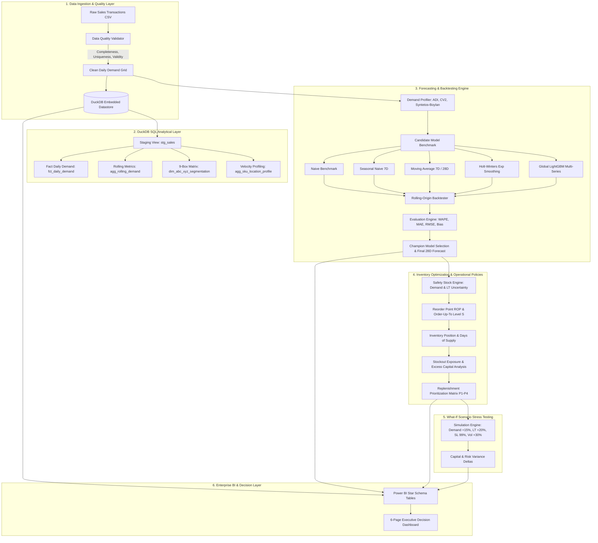

# System Architecture & Technical Flow

## 1. Executive Architecture Overview

The **Demand Forecasting & Inventory Optimization** platform bridges statistical time-series forecasting, machine learning, and operational supply chain decision intelligence. Rather than treating forecasting as an isolated algorithmic exercise, the architecture connects consumer demand signals directly to safety stock buffers, reorder thresholds, capital allocation, and executive what-if scenario simulations.

---

## 2. Core Architectural Pillars

### Pillar 1: Explicit Data Grain & Separation of Boundaries
The fundamental transactional grain is:
$$\text{Observation} = \text{Date} \times \text{Store ID} \times \text{SKU ID}$$
Crucially, the architecture enforces a strict conceptual wall between:
1. **Observed Historical Transactions**: Actual consumer sales recorded in transactions logs.
2. **Model Forecasts & Prediction Intervals**: Mathematical projections of future mean demand and variance.
3. **Operational Assumptions & Policies**: Target service levels ($Z$), review periods ($R$), and supplier lead times ($L$).
4. **Stress Scenarios**: Synthetic multipliers applied to test portfolio resilience under disruption.

### Pillar 2: High-Performance Embedded SQL Layer (DuckDB)
DuckDB provides zero-copy OLAP query execution directly against Parquet files. Complex analytical window functions, cumulative Pareto revenue shares, and rolling demand statistics execute in milliseconds without external database infrastructure.

### Pillar 3: Leak-Free Rolling-Origin Backtesting
Time series cannot be randomly partitioned. The backtesting framework implements an expanding-window strategy evaluating candidate models across 3 historical origins ($T - 84$, $T - 56$, $T - 28$ days). All lag generation and rolling statistics strictly shift by $t-1$, ensuring zero future leakage.

### Pillar 4: Stochastic Lead-Time Inventory Formulation
Rather than assuming deterministic lead times, safety stocks are computed using the Silver-Pyke-Peterson combined uncertainty equation:
$$SS = Z \cdot \sqrt{L \cdot \sigma_D^2 + \bar{D}^2 \cdot \sigma_L^2}$$
This guarantees that supplier delivery variance directly expands the inventory buffer.
