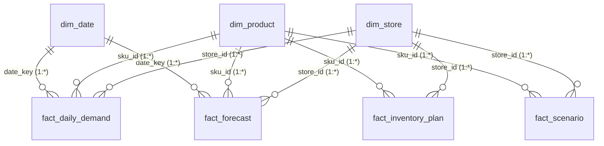

# Power BI Data Model & Dashboard Architecture Guide

## 1. Dimensional Star Schema Architecture

The analytical datastore is organized into a clean star schema optimized for in-memory VertiPaq tabular performance, rapid cross-filtering, and clear business semantics.

### Table Relationships & Cardinality
| From Dimension | Primary Key | To Fact Table | Foreign Key | Cardinality | Cross Filter |
| :--- | :--- | :--- | :--- | :--- | :--- |
| `dim_date` | `date_key` | `fact_daily_demand` | `date_key` | 1 to Many (`1:*`) | Single |
| `dim_date` | `date_key` | `fact_forecast` | `date_key` | 1 to Many (`1:*`) | Single |
| `dim_product` | `sku_id` | `fact_daily_demand` | `sku_id` | 1 to Many (`1:*`) | Single |
| `dim_product` | `sku_id` | `fact_forecast` | `sku_id` | 1 to Many (`1:*`) | Single |
| `dim_product` | `sku_id` | `fact_inventory_plan` | `sku_id` | 1 to Many (`1:*`) | Single |
| `dim_product` | `sku_id` | `fact_scenario` | `sku_id` | 1 to Many (`1:*`) | Single |
| `dim_store` | `store_id` | `fact_daily_demand` | `store_id` | 1 to Many (`1:*`) | Single |
| `dim_store` | `store_id` | `fact_forecast` | `store_id` | 1 to Many (`1:*`) | Single |
| `dim_store` | `store_id` | `fact_inventory_plan` | `store_id` | 1 to Many (`1:*`) | Single |
| `dim_store` | `store_id` | `fact_scenario` | `store_id` | 1 to Many (`1:*`) | Single |

---

## 2. Six-Page Executive Dashboard Blueprint

### Page 1: Executive Inventory Overview
- **Business Goal**: High-level operational health dashboard for VP of Supply Chain and Chief Operating Officer.
- **Top KPIs**:
  1. `[Forecast Demand Value ($)]`: Total projected sales across 28 days.
  2. `[Inventory Capital Tied Up ($)]`: Current working capital deployed in inventory.
  3. `[Critical Stockout SKUs]`: Immediate exposure count requiring escalation.
  4. `[Recommended Reorder Spend ($)]`: Budget required to execute pending purchase orders.
  5. `[Excess Capital ($)]`: Working capital trapped in slow-moving stock.
- **Core Visuals**:
  - *Donut / Bar Chart*: Inventory Health Breakdown (`Critical`, `High`, `Medium`, `Low`, `Excess`).
  - *Clustered Bar Chart*: Recommended Replenishment Spend by Merchandising Category.
  - *Risk Matrix Table*: Top 10 Urgent Replenishment Action Items (`P1 - Critical`).

### Page 2: Demand & Forecast Analysis
- **Business Goal**: Analyze demand trajectories, trend changes, seasonality, and out-of-sample forecast confidence intervals.
- **Top KPIs**: Historical Daily Volume, 28-Day Projected Demand, Week-over-Week Demand Growth.
- **Core Visuals**:
  - *Line & Area Chart*: Historical Daily Demand (actual) joined with 28-day Champion Forecast line flanked by 95% Prediction Interval upper and lower bounds.
  - *Decomposition Tree*: Demand drivers broken down by Category -> Sub-Category -> Store Hub.
  - *Day of Week Heatmap*: Demand intensity across days of week showing weekend peaks.

### Page 3: Forecast Performance & Error Bias
- **Business Goal**: Model evaluation and champion-challenger diagnostics for Analytics Engineers & Data Scientists.
- **Top KPIs**: Champion WAPE %, Global MAE, Global RMSE, Net Bias Units, Normalized Bias %.
- **Core Visuals**:
  - *Clustered Column Chart*: Model Comparison (Naive vs Seasonal Naive vs Moving Average vs Holt-Winters vs LightGBM) ranked by WAPE %.
  - *Scatter Plot*: Actual Demand vs Forecast Demand (45-degree parity reference line).
  - *Bias Tracking Bar*: Underforecasting (Stockout Risk) vs Overforecasting (Excess Risk) by Category.

### Page 4: Inventory Health & ABC/XYZ Segmentation
- **Business Goal**: Merchandising portfolio strategy and stock holding efficiency.
- **Top KPIs**: Total SKUs, Portfolio Days of Supply, Share of Revenue from Class A SKUs, Active Dead Stock Count.
- **Core Visuals**:
  - *9-Box Heatmap Grid*: ABC Revenue vs XYZ Volatility (`AX`, `AY`, `AZ`, `BX`, `BY`, `BZ`, `CX`, `CY`, `CZ`).
  - *Distribution Histogram*: Days of Supply across SKU population (highlighting < 7 days and > 45 days).
  - *Cost vs Revenue Bubble Chart*: SKU unit price vs volume with bubble size proportional to holding cost exposure.

### Page 5: Operational Reorder Recommendations (The Planner Action Table)
- **Business Goal**: Primary daily workspace for Inventory Planners & Procurement Buyers to generate purchase orders.
- **Top KPIs**: Total Active POs Needed, Immediate PO Spend, Supplier Lead Time Range.
- **Core Visuals**:
  - *Interactive Decision Table*:
    - Columns: `Priority Tier`, `Store Hub`, `SKU ID`, `SKU Name`, `Category`, `Daily Demand`, `Current Position`, `Safety Stock`, `Reorder Point`, `Recommended Order Qty`, `Order Spend ($)`, `Stockout Risk`.
    - Conditional Formatting: Red highlight on Critical stockout, Amber on High risk, Green on Reorder Triggered.
  - *Filter Slicers*: Fulfillment Center (`FC-East`, `FC-West`, `FC-Central`), Merchandising Category, Priority Tier.

### Page 6: What-If Scenario Stress Testing
- **Business Goal**: Executive S&OP and scenario planning simulation for supply chain disruptions.
- **Slicers / Parameters**:
  - Demand Shift (+15% surge)
  - Lead Time Disruption (+20% delay)
  - Service Level Target (90%, 95%, 98%, 99%)
  - Volatility Shock (+30% CV)
- **Core Visuals**:
  - *Scenario Comparison Waterfall*: Delta in Safety Stock Capital ($) across scenarios compared to Baseline.
  - *Multi-Card KPI Comparison*: Baseline vs Stressed Required Order Spend and Critical SKU counts.
  - *Sensitivity Tornado Chart*: Incremental working capital required per 1% increase in service level.
